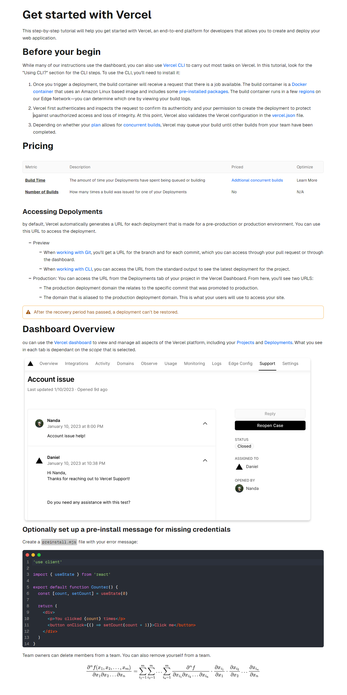

# typora-vercel-theme

A Typora theme that looks and feels like Vercel's familiar document style.

The Vercel theme employs Geist as the primary font, with Inter as the italic variant, and incorporates the LXGWWenKai font to ensure optimal support for Chinese text presentation.

## Install

1. [Download]() the zipped project package from Github.

2. Copy the `vercel.css` file and `vercel` folder to your Typora theme library.

3. Launch or restart Typora and choose `Vercel` from the theme menu.

## Preview

