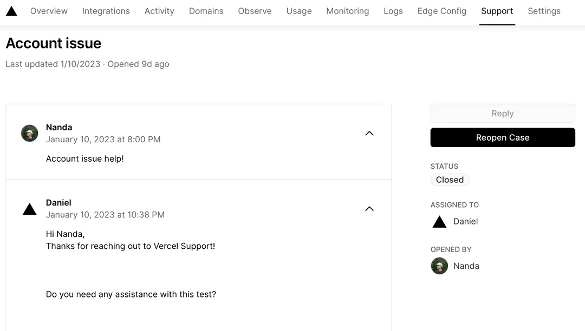

# Get started with Vercel

This step-by-step tutorial will help you get started with Vercel, an end-to-end platform for developers that allows you to create and deploy your web application.

## Before your begin

While many of our instructions use the dashboard, you can also use [Vercel CLI](https://vercel.com/docs/cli) to carry out most tasks on Vercel. In this tutorial, look for the "Using CLI?" section for the CLI steps. To use the CLI, you'll need to install it:

1. Once you trigger a deployment, the build container will receive a request that there is a job available. The build container is a [Docker container](https://www.docker.com/resources/what-container/) that uses an Amazon Linux based image and includes some [pre-installed packages](https://vercel.com/docs/deployments/build-image#pre-installed-packages). The build container runs in a few [regions](https://vercel.com/docs/edge-network/regions) on our Edge Network⁠—you can determine which one by viewing your build logs.
2. Vercel first authenticates and inspects the request to confirm its authenticity and your permission to create the deployment to protect against unauthorized access and loss of integrity. At this point, Vercel also validates the Vercel configuration in the [vercel.json](https://vercel.com/docs/projects/project-configuration) file.
3. Depending on whether your [plan](https://vercel.com/pricing) allows for [concurrent builds](https://vercel.com/docs/deployments/concurrent-builds#usage-and-limits), Vercel may queue your build until other builds from your team have been completed.

## Pricing

| Metric                      | Description                                                  | Priced                                                       | Optimize   |
| --------------------------- | ------------------------------------------------------------ | ------------------------------------------------------------ | ---------- |
| **<u>Build Time</u>**       | The amount of time your Deployments have spent being queued or building | [Addtional concurrent builds](https://vercel.com/docs/pricing#managed-infrastructure-billable-resources) | Learn More |
| <u>**Number of Builds**</u> | How many times a build was issued for one of your Deployments | No                                                           | N/A        |

### Accessing Depolyments

by default, Vercel automatically generates a URL for each deployment that is made for a pre-production or production environment. You can use this URL to access the deployment.

- Preview

  - When [working with Git](https://vercel.com/docs/deployments/generated-urls#generated-from-git), you'll get a URL for the branch and for each commit, which you can access through your pull request or through the dashboard.
  - When [working with CLI](https://vercel.com/docs/deployments/generated-urls#generated-with-vercel-cli), you can access the URL from the standard output to see the latest deployment for the project.
- Production: You can access the URL from the Deployments tab of your project in the Vercel Dashboard. From here, you'll see two URLS:

  - The production deployment domain the relates to the specific commit that was promoted to production.
  - The domain that is aliased to the production deployment domain. This is what your users will use to access your site.


> [!WARNING]
>
> After the recovery period has passed, a deployment can't be restored.

## Dashboard Overview

ou can use the [Vercel dashboard](https://vercel.com/dashboard) to view and manage all aspects of the Vercel platform, including your [Projects](https://vercel.com/docs/projects/overview) and [Deployments](https://vercel.com/docs/deployments/overview). What you see in each tab is dependant on the *scope* that is selected.

  

### Optionally set up a pre-install message for missing credentials

Create a `preinstall.mjs` file with your error message:

```javascript
'use client'
 
import { useState } from 'react'
 
export default function Counter() {
  const [count, setCount] = useState(0)
 
  return (
    <div>
      <p>You clicked {count} times</p>
      <button onClick={() => setCount(count + 1)}>Click me</button>
    </div>
  )
}
```

Team owners can delete members from a team. You can also remove yourself from a team.

$$
\frac{\partial^{n} f(x_1, x_2, \ldots, x_m)}{\partial x_1 \partial x_2 \ldots \partial x_n} = \sum_{i_1=1}^{m} \sum_{i_2=1}^{m} \ldots \sum_{i_n=1}^{m} \frac{\partial^n f}{\partial x_{i_1} \partial x_{i_2} \ldots \partial x_{i_n}} \cdot \frac{\partial x_{i_1}}{\partial x_1} \cdot \frac{\partial x_{i_2}}{\partial x_2} \ldots \frac{\partial x_{i_n}}{\partial x_n}
$$


